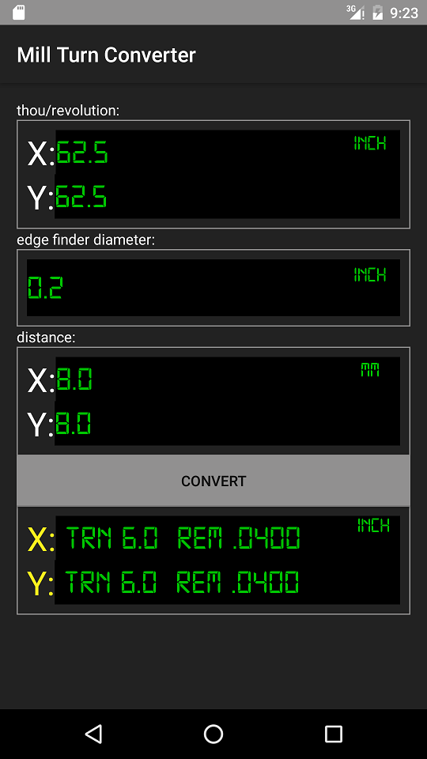

# Mill Turn Converter
For those machinist that don't have a DRO, this application will take the complicated math out of your machining operations by allowing you to simply count the turns of the X and Y wheels.

Click the unit buttons (inch/mm) to change the units for the selected group.

Once configured hit the Convert button.

TRN represents the number of complete turns of the adjustment wheel.

REM represents the remainder distance after turning. (metric or standard units)

Settings are saved for next use.

Enjoy!

Screenshot

