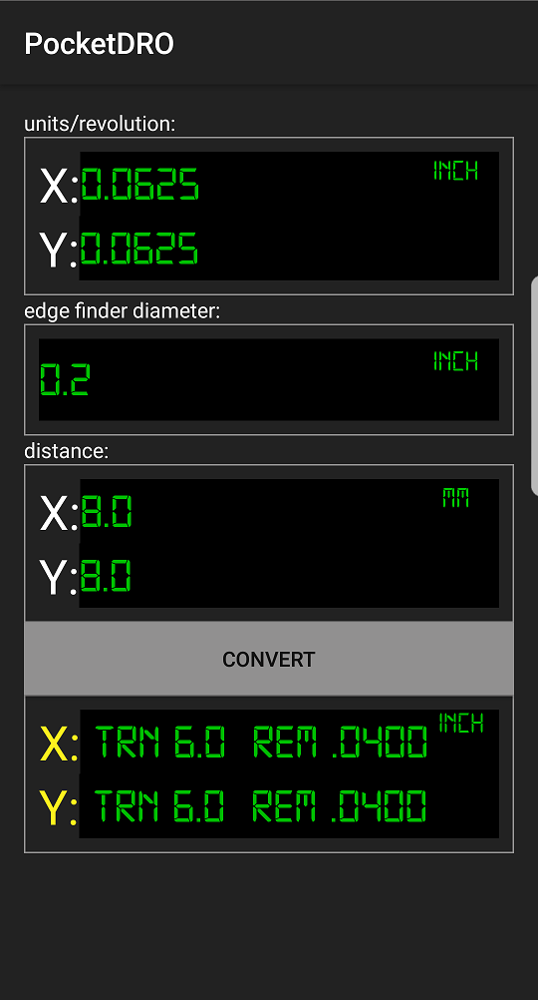
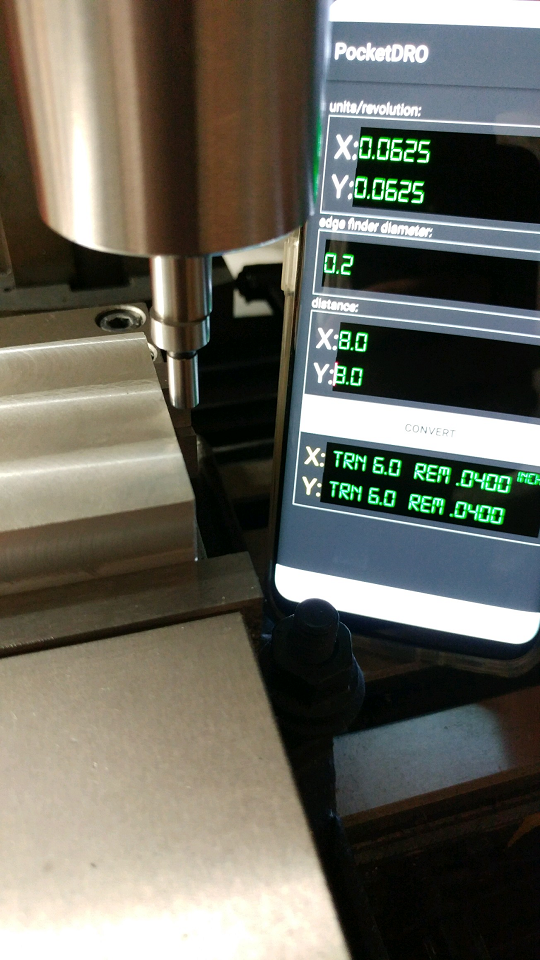

# PocketDRO

Manual Machining Made A Little Easier

For those machinist that don't have a DRO, this application will take the math out of your machining operations by allowing you to simply count the turns of the X,Y and Z hand wheels.
Simply find the edge of your part and enter the distance you need to move for each axis. The PocketDRO will calculate the number of complete turns and the remaining units needed to get you right on target.
This application was created because I was tired of manually calculating X,Y, and Z distances with the odd index numbers on my hand wheels (.0625in). Also included in the manual calculations were conversions from metric to standard units because most of the schematics I follow are in metric, and my mill indexes are in standard.
PocketDRO makes it very easy to use any combination of metric or standard unit inputs, and the number of turns for a given axis is a much easier number to deal with.

Click the unit buttons (inch/mm) to change the units for the selected group.

Once configured hit the Convert button.

TRN represents the number of complete turns of the adjustment wheel.

REM represents the remainder distance after turning. (metric or standard units)

Settings are saved for next use.

Enjoy!

Screenshot

